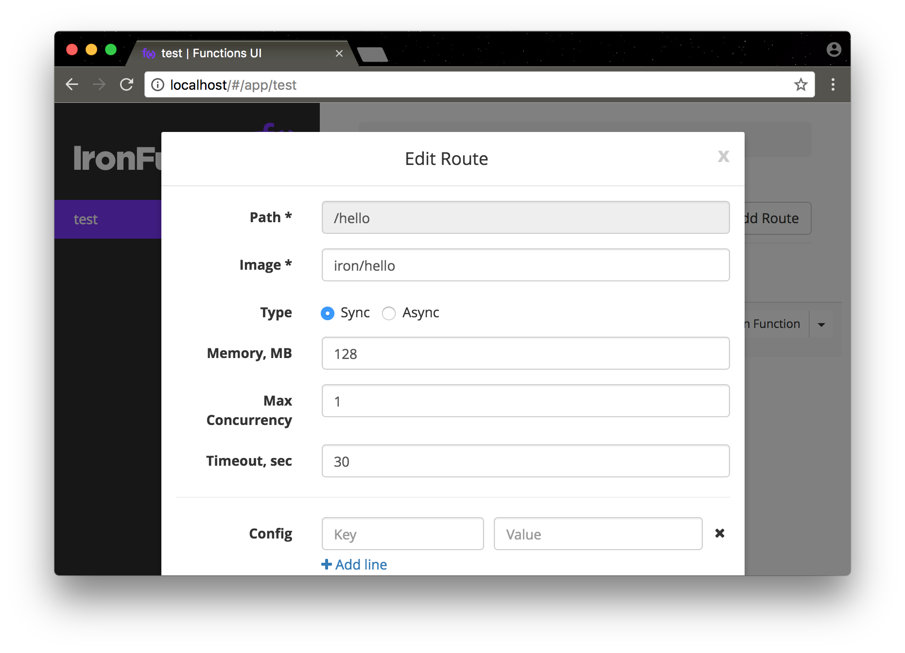

# iron-functions

docker-compose.yml for iron-functions

- https://github.com/iron-io/functions
- https://github.com/iron-io/functions-ui

### Usage

``` bash
cp proxy/etc/h2o.conf.sample proxy/etc/h2o.conf
sed -i 's/example\.com/localhost/' proxy/etc/h2o.conf
docker-compose up -d
```

### Screen Shot


